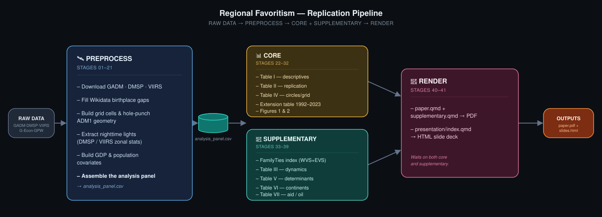

# Regional Favoritism

## A Replication and Extension of Hodler & Raschky (2014)

This package reproduces every table and figure reported in the paper and
its supplementary materials, from raw data through the final PDF and
presentation, following a 41-stage numbered pipeline.

Hodler and Raschky (2014, *QJE*) find that a region grows brighter at
night while it is the birth region of the sitting political leader,
evidence of regional favoritism. This package rebuilds that finding on an
independently constructed pipeline (GADM boundaries instead of the
authors' CIESIN source, PLAD plus a Wikidata supplement for birthplaces,
DMSP-OLS composites extracted locally), then extends it to a harmonized
DMSP/VIIRS panel running through 2023. See `04_paper/paper.qmd` for the
full text and `04_paper/supplementary.qmd` for the supplementary tables --
both, and the `05_presentation/` slide deck, ship inside this package (see
"Paper and presentation" below).

### Scope

The package is organized in two analysis phases:

- **Core** (`03a_analysis_core/`, Stages 22-32): what the main paper
  reads — Table 1 (descriptive statistics), Table 2 (HR 2014 Table II
  replication), Table 3/Figure 2 (HR 2014 Table IV replication, all seven
  columns), the 1992-2023 extension table, and Figure 1.
- **Supplementary** (`03b_analysis_supplementary/`, Stages 33-39): what
  `supplementary.qmd` additionally reads — the FamilyTies WVS/EVS index,
  the Table V/VII covariates, and HR 2014 Table III (dynamics), Table V
  (determinants), Table VI (continents), and Table VII (aid/oil).

Side-investigations not reported in either document (the ethnic-homeland
extension, the Turkey earthquake case study, non-exact-sample regression
variants) and HR 2014's own Online Appendix are out of scope for this
package.

---

## Quickstart

The large files this pipeline produces are tracked with Git LFS and
shipped in this repository, so a fresh clone can reproduce every table
without downloading or processing any raw data:

```bash
git lfs install                                  # once per machine
git clone https://github.com/ofurkancoban/Regional_Favoritism_Replication.git
cd replication_package
make init                                              # install R packages
Rscript 02_scripts/01_setup/setup_environment.R --stage=core
Rscript 02_scripts/01_setup/setup_environment.R --stage=supplementary
Rscript 02_scripts/01_setup/verify_outputs.R           # checks headline numbers
```

Reproducing the upstream pipeline that builds these files from raw data
(Stages 01-21: downloads, geometry, nighttime-lights extraction) is a
slower, partly manual path, described below under "Raw data that cannot
be downloaded automatically."

Stages 24, 25, 29, and 30 also write a standalone, browsable HTML view of
Table 1, Table 2, Table 4, and the extension table to
`03_results/tables/html/`, viewable in a browser without compiling
`paper.pdf`.

---

## Reproducibility Guide

This package uses `renv` for dependency management and a `Makefile` for
pipeline orchestration.

### Method 1: Make (recommended)

```bash
make init          # install exact package versions from renv.lock
make preprocess     # stages 01-21
make core           # stages 22-32: main paper's tables, extension, figures
make supplementary  # stages 33-39: supplementary.qmd's Table III, V, VI, VII
make render         # stages 40-41: paper + supplementary + presentation
```

GADM 3.6, G-Econ, GPWv3, GPWv4, and GHS-POP require a manual,
registration-gated download before `make preprocess` (see below). GADM
4.1, DMSP, and VIIRS download automatically as part of `make preprocess`.
`make core` and `make supplementary` need nothing manual: PLAD, Archigos,
QoG, and the WVS/EVS Trend Files ship with this repository.

### Method 2: R orchestrator

```r
# from regional_favoritism_replication.Rproj
source("02_scripts/01_setup/setup_environment.R")
```

Pass `--stage=preprocess`, `--stage=core`, `--stage=supplementary`, or
`--stage=render` via `commandArgs()` to run a subset.

### Method 3: Granular targets

| Target                                           | Stages | Description                                                                                       |
| ------------------------------------------------ | ------ | ------------------------------------------------------------------------------------------------- |
| `make init`                                    | —     | Install package versions pinned in`renv.lock`                                                   |
| `make preprocess`                              | 01-21b | Geometry, nighttime-lights extraction, covariates, panel assembly                                 |
| `make core`                                    | 22-32  | Main paper's regression tables, extension, figures                                                |
| `make supplementary`                           | 33-39  | supplementary.qmd's Table III, V, VI, VII                                                         |
| `make paper`                                   | 40     | Render the paper and supplementary materials (PDF)                                                |
| `make presentation`                            | 41     | Render the Reveal.js presentation (HTML)                                                          |
| `Rscript 02_scripts/01_setup/verify_outputs.R` | —     | Checks every headline coefficient against the paper's reported values; exits non-zero on mismatch |

---

## Pipeline Overview



`make preprocess` produces `analysis_panel.csv`, the single shared input
for both `make core` and `make supplementary`. The two analysis phases
are independent of each other and can run in either order or in
parallel; both must complete before `make render` produces a PDF that
reflects current results.

---

## Project Structure

```text
.
├── 01_datasets/
│   ├── raw/                        # inputs under ~50MB tracked directly;
│   │                                #   larger files via Git LFS or symlink
│   ├── processed/                  # same convention as raw/
│   └── final/                      # small package-local outputs
├── 02_scripts/
│   ├── 01_setup/                   # pipeline orchestrator, pre-flight checks
│   ├── 02_data_preprocessing/      # Stages 01-21
│   ├── 03a_analysis_core/          # Stages 22-32
│   ├── 03b_analysis_supplementary/ # Stages 33-39
│   └── 04_tools/                   # shared helper functions (utils.R)
├── 03_results/
│   ├── figures/                    # Figure 1 and Figure 2
│   └── tables/html/                # Table 1, 2, 4, and the extension table (gt)
├── 04_paper/                       # the paper and supplementary materials
│   ├── 40_Render_Paper.R           # renders paper.qmd, supplementary.qmd
│   ├── paper.qmd, supplementary.qmd
│   ├── paper.pdf, paper.html, supplementary.pdf, supplementary.html
│   ├── references.bib, elsarticle.cls, elsarticle-harv.bst, before-body.tex
│   ├── img/, R/, _extensions/
├── 05_presentation/                # the Reveal.js slide deck
│   ├── 41_Render_Presentation.R    # renders index.qmd
│   ├── index.qmd, index.html, Coban_RegionalFavoritism.pdf
│   ├── theme.scss, references.bib, apa.csl
│   ├── img/, _assets/, _extensions/
├── Makefile
├── renv.lock
└── regional_favoritism_replication.Rproj
```

### Paper and presentation

`04_paper/` and `05_presentation/` ship as real, physical copies inside
this package -- not symlinks, not rendered from an outside "main
repository" -- since this package is itself the repository root on
GitHub. Both PDF and HTML are already built and included, so opening
`04_paper/paper.pdf` or `05_presentation/index.html` needs no rendering
step at all; `make paper` / `make presentation` (Stages 40-41) only matter
if you edit the `.qmd` source and want to rebuild. The four result
tables `paper.qmd` reads (Table I/II/IV, the extension table) and the
supplementary tables `supplementary.qmd` reads point at this package's
own `01_datasets/processed/ntl/` outputs, so re-running `make core` /
`make supplementary` before re-rendering the paper picks up any new
numbers automatically.

---

## Data

### Shipped with this package

Every input under ~50MB that a script in this package reads is tracked
directly as git content. Ten larger, project-derived files (the analysis
panel, the harmonized DMSP/VIIRS panel, hole-punched ADM1 geometry, grid
cells at four resolutions, the extension's fitted models, and the QoG
Time-Series dataset) are tracked via Git LFS, gzip-compressed except the
`.rds`. The WVS Trend File, EVS Trend File, PLAD, and Archigos also ship
with the package. Git LFS must be installed once per machine
(`git lfs install`) before cloning; `git clone` then pulls all LFS files
automatically.

`setup_environment.R` decompresses whichever shipped files the requested
`--stage` needs before running any stage (`ensure_shipped_inputs()` in
`02_scripts/01_setup/check_raw_data.R`), so every consuming script reads
each file in its plain, uncompressed form regardless of how it is
tracked.

### Excluded: third-party raw geometry and rasters

`gadm_3.6/`, `dmsp_raster_eog_manual/`, and `viirs_raster_eog_manual/`
are excluded from version control (multi-GB to hundreds of GB, and some
sources restrict redistribution). DMSP and VIIRS download automatically
via Stages 03-04; GADM 3.6 requires a manual download (see below).

### Raw data that cannot be downloaded automatically

Every `setup_environment.R` run checks required files against the
requested `--stage` before running anything, and reports any missing
file with its download link, registration requirement, and destination
path, rather than failing later with an opaque error.

| Dataset                                | Link                                                                                                                | Registration                                                                       | Used by                                                            | Destination                                                 |
| -------------------------------------- | ------------------------------------------------------------------------------------------------------------------- | ---------------------------------------------------------------------------------- | ------------------------------------------------------------------ | ----------------------------------------------------------- |
| GADM 3.6 (levels 0-2)                  | [https://geodata.ucdavis.edu/gadm/gadm3.6/](https://geodata.ucdavis.edu/gadm/gadm3.6/)                               | Free                                                                               | Hole-punched geometry, Table IV Cols 2-3, Figure 2                 | `01_datasets/raw/gadm_3.6/gadm36_levels.gpkg`             |
| G-Econ 4.0 (Nordhaus et al.)           | [https://gecon.yale.edu](https://gecon.yale.edu)                                                                     | Free                                                                               | Gridded regional GDP, Table II Column 8                            | `01_datasets/raw/gecon/`                                  |
| GPWv3 population count, 1990/1995      | [https://sedac.ciesin.columbia.edu/data/collection/gpw-v3](https://sedac.ciesin.columbia.edu/data/collection/gpw-v3) | Free, NASA Earthdata login                                                         | Population covariates                                              | `01_datasets/raw/GPWv3_pcount/`                           |
| GPWv4 population count, 2000/2005/2010 | [https://sedac.ciesin.columbia.edu/data/collection/gpw-v4](https://sedac.ciesin.columbia.edu/data/collection/gpw-v4) | Free, NASA Earthdata login                                                         | Population covariates                                              | `01_datasets/raw/gpw/population/pop/`                     |
| GHS-POP (Global Human Settlement)      | Google Earth Engine catalog                                                                                         | Free, Google account +[Earth Engine signup](https://earthengine.google.com/signup/) | Population interpolation                                           | Accessed live via GEE; run`earthengine authenticate` once |

GADM 4.1, DMSP, and VIIRS download automatically (Stages 01-04) and need
no manual step.

---

## System Requirements

- **R (>= 4.3)**: [https://cran.r-project.org/](https://cran.r-project.org/)
- **Git LFS**: [https://git-lfs.com/](https://git-lfs.com/), then `git lfs install` once per machine
- **Quarto CLI**: [https://quarto.org/get-started/](https://quarto.org/get-started/)
- **TinyTeX**: installed automatically by `setup_environment.R` if missing
- **A Chrome, Chromium, or Edge binary**: for rasterizing Figures 1 and 2; auto-detected, or set `REGIONAL_FAVORITISM_CHROME_BIN`
- **Python 3 + `earthengine-api`** (via `reticulate`), with an authenticated Earth Engine account, needed only for `02_data_preprocessing/19_ghs_pop_gee.R`
- **System libraries** for `sf`/`terra`:
  - macOS: `brew install gdal geos proj`
  - Linux: `sudo apt-get install libgdal-dev libgeos-dev libproj-dev`

### Environment variables (all optional)

| Variable                           | Default                                     | Used by                          |
| ---------------------------------- | ------------------------------------------- | -------------------------------- |
| `REGIONAL_FAVORITISM_ROOT`       | `here::here()`                        | `03a_analysis_core/31`, `32` |
| `REGIONAL_FAVORITISM_LM_DIR`     | autodetected via`tinytex::tinytex_root()` | `03a_analysis_core/31`, `32` |
| `REGIONAL_FAVORITISM_CHROME_BIN` | autodetected                                | `03a_analysis_core/31`, `32` |

---

## Key Dependencies

Version-pinned in `renv.lock`, installed via `make init`.

- `fixest`: fixed-effects estimation for every regression table
- `data.table`: panel construction and zonal-statistics output
- `sf` / `terra` / `exactextractr`: boundary geometry and raster zonal statistics
- `here`: package-relative file paths
- `gt`: styled HTML export for Tables 1, 2, 4, and the extension table

`make init` installs the versions pinned in `renv.lock` into the active R
library rather than an isolated renv environment, so scripts run against
whatever R installation is already active.

---

**Author:** Ömer Furkan Çoban
**Course:** Applied Econometrics Using GIS Techniques, Uni Oldenburg (SoSe 2026)
**Lecturer:** Prof. Dr. Erkan Gören
