# Agenda {.section-slide .hide-progress .skip-progress visibility="uncounted"}

::: {.section-eyebrow}
Section 01 / 07
:::

## Agenda {.content-slide .hide-progress .skip-progress}

- Introduction
- Literature
- Data Sources
- Empirical Framework
- Extension
- Conclusion

::: {.notes}
Today's agenda is, first I'll explain what regional favoritism is, then
introduce the paper, then walk through the data and methodology, then
introduce my extension, and finish up.

Let's start with the concept itself.
:::

# Introduction {.section-slide visibility="uncounted"}

::: {.section-eyebrow}
Section 02 / 07
:::

## What's Regional Favoritism? {.content-slide}

The tendency of national leaders to direct disproportionate public resources toward their own birth region, rather than allocating them on the basis of need or national interest.

### How It's Measured {.larger}

- Compare a leader's birth region against all other regions of the same country, in the same year
- Use satellite-recorded nighttime light intensity as a proxy for local economic activity
- Ask whether the birth region gets systematically brighter while its leader is in power

::: {.notes}
Regional favoritism is when leaders steer resources toward their own
birth region, not where they're most needed. 

Government spending data can't
test this, it's missing or unreliable exactly where favoritism would
matter most, so we use nighttime light as a proxy instead. It's
satellite-measured, the same method everywhere, and no government can
edit it.

We compare a leader's birth region to other regions in the same country and year, and ask whether it gets brighter while that leader is in power.
:::

## An Example: Ivory Coast {.content-slide .figure-slide}

::: {.case-study-figure}
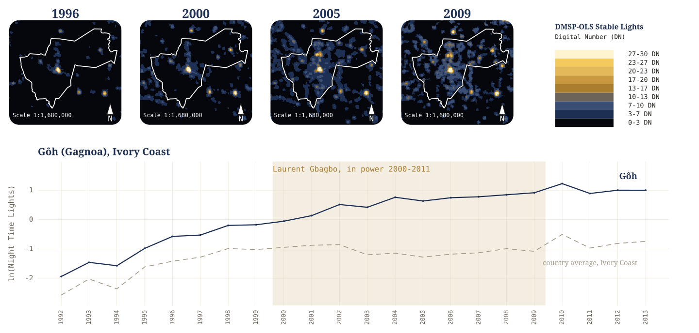
:::

::: {.notes}
Here's one concrete case. This is Gôh in Ivory Coast, the birthplace of
Laurent Bqagbo, who took office in 2000. The dashed line is the country
average, and the solid line is Gôh. They track closely through the
nineteen nineties, and then right at 2000 they split apart. Gôh pulls
away from the national average and keeps climbing, while the rest of the
country stays flat.

You can see it in the maps too. Watch the lit area right inside the
region's boundary get thicker and brighter across those four years. 
:::

## The Paper We Replicate {.content-slide .paper-slide}

::: {.columns}
::: {.column width="60%"}

### Hodler & Raschky (2014), *Quarterly Journal of Economics*

::: {.fact}
[Research question]{.fact-label}

Do national leaders steer resources to the region they were born in? And if so,
how far does the effect reach geographically, how long does it last, and where is
it worst?
:::

::: {.fact}
[Sample]{.fact-label}

**38,427 subnational regions in 126 countries**, observed annually from
**1992 to 2009**, covering the entire usable DMSP-OLS satellite nighttime light record at the time.
:::

::: {.fact}
[Empirical Strategy]{.fact-label}

The outcome is nighttime light intensity. A region is treated in the years its
country's effective leader was born there. Region and country-year fixed effects
hold the comparison **within country, within year**.
:::

::: {.fact}
[Finding]{.fact-label}

Birth regions are about **4% brighter** while their leader is in office. The
effect is strongest where institutions are weak and education low, and it is
amplified by foreign aid and oil rents [@hodler2014].
:::

:::
::: {.column width="40%"}

::: {.paper-cover}
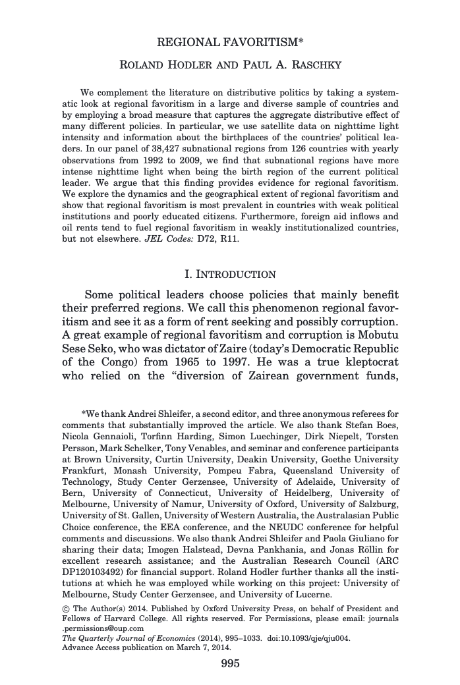
:::

:::
:::

::: {.notes}
This is the original paper authored by Hodler and Raschky, in Quarterly Journal of Economics, in 2014. 

Their panel covers
38,427 regions in 126 countries, 1992 to 2009, basically the full
usable DMSP satellite record at the time.

The outcome they use is nighttime light intensity. Their empirical
strategy controls for two things. It controls for anything that never
changes about a place, and it controls for anything that hits the whole
country at once in a given year. So what's really being compared is
one region against the rest of its own country, in that same year.

Headline number is four percent brighter. It's strongest where
institutions are weak and education is low, and it grows with aid and
oil money, so favoritism needs both a motive and the means.

My job was to reproduce this first, then push the data past 2009.
:::

# Literature {.section-slide visibility="uncounted"}

::: {.section-eyebrow}
Section 03 / 07
:::

## Literature {.content-slide .lit-slide}

::: {.columns-2}
::: {}
::: {.col-heading}
Foundational
:::

::: {.lit-entry}
[Measuring Economic Growth from Outer Space]{.lit-title} [[@henderson2012]]{.paper-cite}

- **Data:** Nighttime lights matched to national GDP growth, cross-country panel
- **Scope:** Validating satellite light growth as an economic-activity proxy
- **Finding:** Light growth is an **independent proxy for GDP growth** that outperforms official statistics where national accounts are weak
:::

::: {.lit-entry}
[Distributive Politics Around the World]{.lit-title} [[@golden2013]]{.paper-cite}

- **Data:** Review of the distributive-politics literature, no single dataset
- **Scope:** How political favoritism has been measured across countries
- **Finding:** Prior work relied almost entirely on **single-country spending data**, leaving systematic cross-country evidence largely absent
:::
:::
::: {}
::: {.col-heading}
Related / Extensions
:::

::: {.lit-entry}
[Does the Leader's Ethnicity Matter?]{.lit-title} [[@franck2012]]{.paper-cite}

- **Data:** Demographic and Health Surveys, Sub-Saharan Africa
- **Scope:** Ethnic favoritism in health and education outcomes
- **Finding:** Districts sharing the president's ethnicity see **relative gains in education and child mortality** while that leader is in power
:::

::: {.lit-entry}
[Birthplace Favoritism Revisited]{.lit-title} [[@bora2025]]{.paper-cite}

- **Data:** VIIRS nighttime lights, 2012-2025, matched to PLAD birthplaces and GADM boundaries
- **Scope:** Robustness of birthplace favoritism in the modern, high-frequency era
- **Finding:** Favoritism starts **immediately on taking office** and persists after leaving it, with a further premium during COVID-19 in weaker democracies
:::
:::
:::

::: {.notes}
Four papers to place this project on the map.

Two are foundational. Henderson, Storeygard and Weil is the paper that made
nighttime lights usable for economics in the first place: they show that the
change in light output tracks GDP growth well enough to substitute for official
statistics, which matters most exactly where those statistics are worst. 

Golden
and Min then surveyed the distributive-politics literature and found the field
had been stuck at single-country spending data. That gap is precisely what
Hodler and Raschky's satellite approach was built to close.

The other two push on the mechanism and the modern data. Franck and Rainer use
household survey data across Sub-Saharan Africa and find the same logic one
level down: districts that share the president's own ethnicity see real gains
in health and education outcomes while that leader is in power. 

And Bora
pushed into the VIIRS era, with monthly rather than annual data, and found two
things I did not expect: the effect shows up immediately when a leader takes
office rather than with a lag, and it spiked again during COVID, concentrated
in weaker democracies.

That last point is a nice preview of where my own extension is headed.
:::

# Data {.section-slide visibility="uncounted"}

::: {.section-eyebrow}
Section 04 / 07
:::

## Data Sources: Outcome, Geography & Leaders {.content-slide .ds-slide}

<table class="ds-table">
<thead>
<tr><th>Source</th><th>Coverage</th><th>Used For</th></tr>
</thead>
<tbody>

<tr class="ds-cat"><td colspan="3">Outcome Variable</td></tr>
<tr>
<td class="ds-source">
01

DMSP-OLS Nighttime Lights

30 arc-sec (&sim;1&nbsp;km) &middot; WGS84 (EPSG:4326) &middot; geographic, unprojected

[@noaa-dmsp]

</td>
<td class="ds-coverage"><strong>Annual, 1992-2014</strong> &middot; 0-63 DN scale &middot; sub-km pixels, all countries</td>
<td class="ds-use"><strong>Dependent variable</strong>: <code>log(light&nbsp;+&nbsp;0.01)</code>, average pixel intensity per region-year. A high concentration of observations sits at the lower bound, hence the added constant.</td>
</tr>

<tr class="ds-cat"><td colspan="3">Political Leaders</td></tr>
<tr>
<td class="ds-source">
02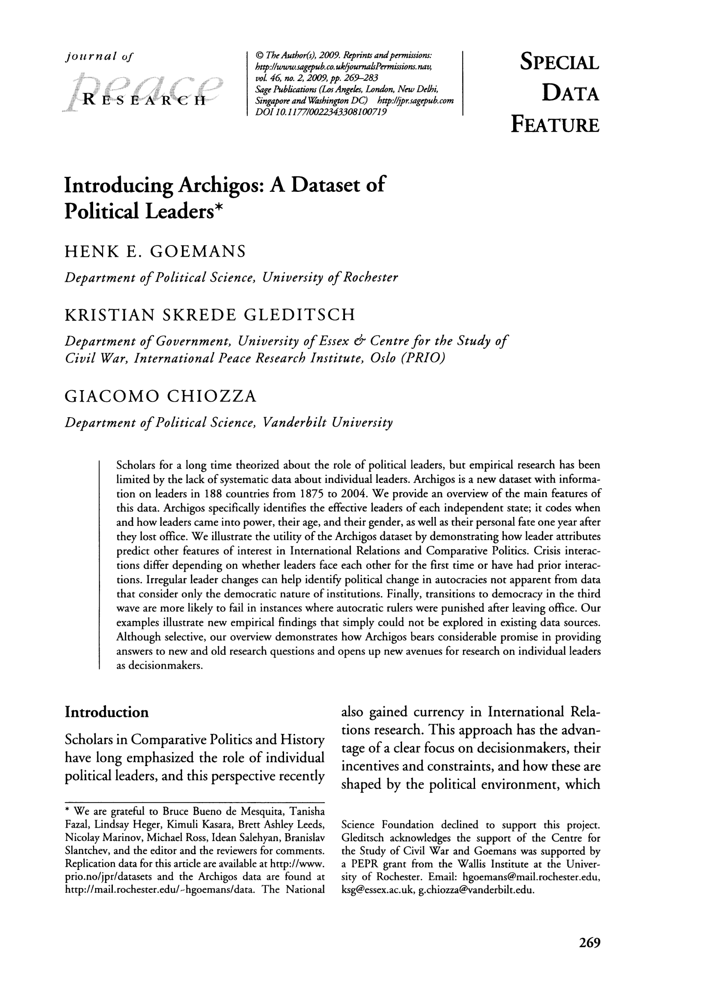

Archigos, extended with birthplaces

[@goemans2009]

</td>
<td class="ds-coverage">Effective leader per country-year to 2004, <strong>hand-extended by HR to 2010</strong>. Base universe: <strong>919 leader-spells, 172 countries</strong>.</td>
<td class="ds-use">Defines <strong>who was leading which country, and when</strong>: the base list rows 3 and 4 attach a birthplace onto. Constructs <code>Experience</code> and <code>TotalTenure</code> directly; contributes no birthplace itself.</td>
</tr>
<tr class="ds-subrow">
<td class="ds-source">
03

&darr;PLAD Birthplace Coordinates

[@plad2024]

</td>
<td class="ds-coverage">Matches <strong>799 / 919</strong> leader-spells (<strong>86.9%</strong>). Zero coverage for <strong>25 countries</strong>.</td>
<td class="ds-use"><strong>Primary</strong> birthplace source for our own panel: coordinates point-in-polygon joined to GADM ADM2. <strong>Authoritative</strong> wherever it has an entry.</td>
</tr>
<tr class="ds-subrow">
<td class="ds-source">
04

&darr;Wikidata/Wikipedia Scrape

[@wikidata-supplement]

</td>
<td class="ds-coverage">108 missing leaders queried, 42 resolved, <strong>33</strong> confirmed in-country.</td>
<td class="ds-use"><strong>Gap-fill only</strong> where PLAD has zero coverage. Combined coverage: 799 + 33 = <strong>832 / 919 = 90.5%</strong>.</td>
</tr>

<tr class="ds-cat"><td colspan="3">Geography</td></tr>
<tr>
<td class="ds-source">
05

Subnational Boundaries & Settlement Points We use GADM 3.6

Vector polygons &middot; WGS84 (EPSG:4326) &middot; geographic, unprojected

[@ciesin-subadbnd] &rarr; [@gadm36]

</td>
<td class="ds-coverage">Second-level administrative regions &middot; <strong>126 countries, 38,427 regions</strong>. Excludes countries under <strong>500,000</strong> people and any territory entirely above <strong>65&deg;N</strong>.</td>
<td class="ds-use">Defines HR's regional units of observation; settlement-point shapefiles geolocate leader birthplaces to a specific region. This CIESIN product was <strong>never publicly released</strong> as underlying data (SEDAC serves only PDF/PNG map previews), so our own geometry substitutes <strong>GADM 3.6</strong>.</td>
</tr>

<tr class="ds-cat"><td colspan="3">Population</td></tr>
<tr>
<td class="ds-source">
06

Gridded Population of the World, v3 &amp; v4

GPWv3 2.5 arc-min &middot; GPWv4 5 arc-min &middot; WGS84 (EPSG:4326), unprojected

[@ciesin-gpwv3] &middot; [@ciesin-gpwv4]

</td>
<td class="ds-coverage">Region-year &middot; <strong>GPWv3</strong> anchors 1990/1995, <strong>GPWv4 rev.11</strong> anchors 2000/2005/2010, bridged and interpolated to an annual panel</td>
<td class="ds-use">Builds <code>lnpop</code> (log regional population in thousands) and the per-capita light outcome <code>Lightpc</code>. HR's Appendix A sources <code>Population_ict</code> from CIESIN "every fifth year from 1990," which is <strong>GPWv3</strong>; <strong>GPWv4 (2018)</strong> did not exist yet at HR's writing, so it extends the same CIESIN series past 2010. The two products' 2000 overlap year is used to compute a <strong>per-country bridge factor</strong>, scaling GPWv4 onto GPWv3's level before interpolating.</td>
</tr>

</tbody>
</table>

::: {.notes}
Data Sources (Kendin sun)
:::

## Data Sources: Country-Level Covariates {.content-slide .ds-slide}

<table class="ds-table">
<thead>
<tr><th>Source</th><th>Coverage</th><th>Used For</th></tr>
</thead>
<tbody>

<tr class="ds-cat"><td colspan="3">Institutions & Human Capital</td></tr>
<tr>
<td class="ds-source">
07

Political Regime Characteristics

[@marshall2010]

</td>
<td class="ds-coverage">Country-year, 1800-2010 &middot; rescaled <strong>Polity2 score, 0 to 1</strong></td>
<td class="ds-use">Measures <strong>executive constraints</strong> and openness of political competition; interacted with <code>Leader</code> in <strong>Table V</strong>.</td>
</tr>
<tr>
<td class="ds-source">
08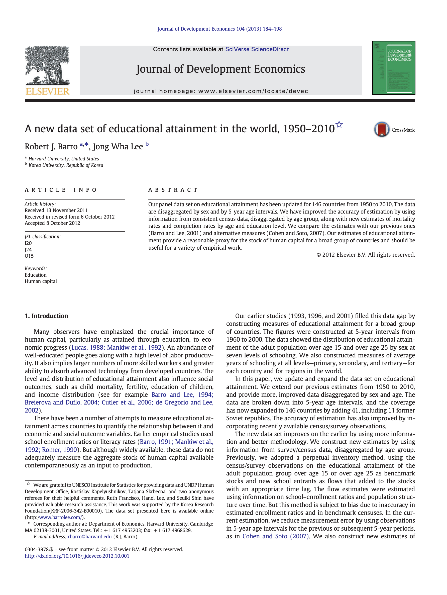

Educational Attainment Dataset

[@barrolee2013]

</td>
<td class="ds-coverage">Country-year &middot; 5-year intervals, <strong>1950-2010</strong></td>
<td class="ds-use"><strong>Average years of schooling</strong> attained; a second institutional-quality proxy interacted with <code>Leader</code>.</td>
</tr>

<tr class="ds-cat"><td colspan="3">Economic & Cultural Covariates</td></tr>
<tr>
<td class="ds-source">
09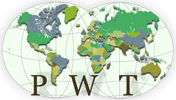

Penn World Table, GDP per Capita

[@pwt71]

</td>
<td class="ds-coverage">Country-year, U.S. dollars</td>
<td class="ds-use"><strong>Log GDP per capita</strong>, the baseline economic control for national income.</td>
</tr>
<tr>
<td class="ds-source">
10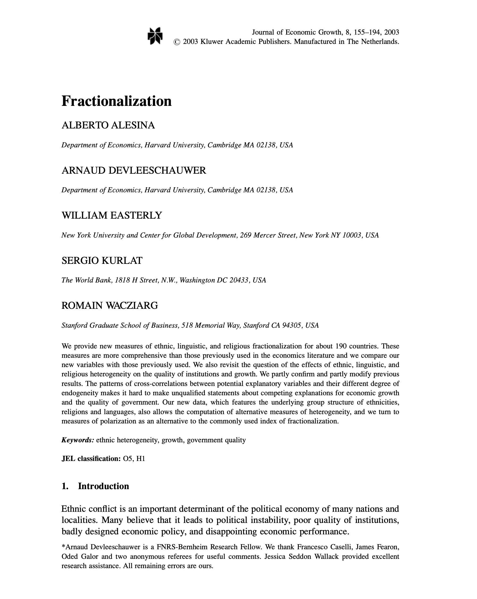

Linguistic Fractionalization

[@alesina2003]

</td>
<td class="ds-coverage">Country level, <strong>time-invariant</strong></td>
<td class="ds-use"><strong>Probability</strong> two random citizens speak different languages; interacted with <code>Leader</code> as a cultural-cohesion proxy.</td>
</tr>
<tr>
<td class="ds-source">
11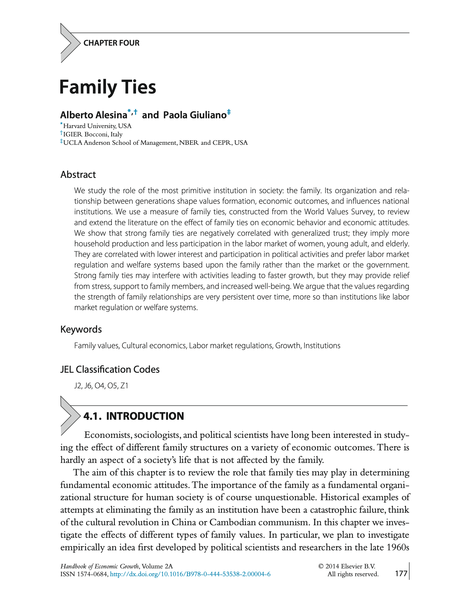

Family Ties

[@alesina2014]

</td>
<td class="ds-coverage">Country level, <strong>time-invariant</strong></td>
<td class="ds-use">Strength of family bonds from <strong>World Values Survey</strong> responses; interacted with <code>Leader</code> alongside fractionalization.</td>
</tr>

<tr class="ds-cat"><td colspan="3">External Resource Flows</td></tr>
<tr>
<td class="ds-source">
12

Net Official Development Assistance

[@oecd-ids]

</td>
<td class="ds-coverage">Country-year, current U.S. dollars</td>
<td class="ds-use"><strong>Log Official Development Assistance per capita</strong>; interacted with <code>Leader</code> in <strong>Table VII</strong> to test whether aid inflows fuel favoritism.</td>
</tr>
<tr>
<td class="ds-source">
13

Adjusted Net Savings, Oil Rents

[@wb-ans]

</td>
<td class="ds-coverage">Country-year, current U.S. dollars per capita</td>
<td class="ds-use"><strong>Log oil rents per capita</strong>; interacted with <code>Leader</code> alongside aid in the same heterogeneity test.</td>
</tr>

<tr class="ds-cat"><td colspan="3">Alternative Outcome (Robustness)</td></tr>
<tr>
<td class="ds-source">
14
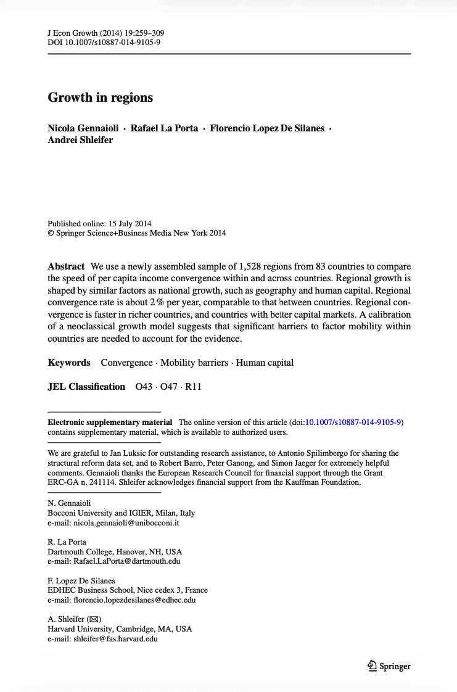

Subnational Regional GDP Data We use G-Econ 4.0

1 degree grid (&sim;111&nbsp;km) &middot; WGS84 (EPSG:4326), unprojected

[@gennaioli2014] &rarr; [@gecon2006]

</td>
<td class="ds-coverage">1-degree global grid &middot; benchmark years 1990/95/2000/05, <strong>190 countries</strong>, aggregated to ADM2 by point-in-polygon join</td>
<td class="ds-use"><strong>Regional GDP per capita</strong> for Column (8). HR's own source, Gennaioli et al. (2014), <strong>is not publicly available</strong>. Reproduces the same direction and significance (<strong>0.016</strong> vs. HR's published <strong>0.021</strong>).</td>
</tr>

</tbody>
</table>

::: {.notes}
(kendin sun)
:::

## Data Sources: Descriptive Statistics {.content-slide .cmp-slide}

<table class="cmp-table">
<thead>
<tr><th rowspan="2">Variables</th><th colspan="5">Hodler &amp; Raschky (2014) 126 countries &middot; 1992-2009</th><th colspan="5">Our Panel, HR-Exact Sample same 126 countries &middot; 1992-2009</th></tr>
<tr><th>Obs.</th><th>Mean</th><th>SD</th><th>Min</th><th>Max</th><th>Obs.</th><th>Mean</th><th>SD</th><th>Min</th><th>Max</th></tr>
</thead>
<tbody>

<tr class="cmp-shade"><td class="cmp-var">Lightict</td><td>690,495</td><td>0.050</td><td>2.482</td><td>-4.605</td><td>4.143</td><td>655,659</td><td>0.098</td><td>2.456</td><td>-4.605</td><td>4.143</td></tr>
<tr><td class="cmp-var">Leaderict-1</td><td>690,495</td><td>0.004</td><td>0.060</td><td>0.000</td><td>1.000</td><td>613,433</td><td>0.004</td><td>0.060</td><td>0.000</td><td>1.000</td></tr>
<tr class="cmp-shade"><td class="cmp-var">Polityct-1</td><td>684,213</td><td>0.789</td><td>0.257</td><td>0.000</td><td>1.000</td><td>612,746</td><td>0.789</td><td>0.258</td><td>0.000</td><td>1.000</td></tr>
<tr class="cmp-subrow cmp-shade"><td class="cmp-var-sub"></td><td>(2,205)</td><td>(0.670)</td><td>(0.312)</td><td></td><td></td><td>(1,922)</td><td>(0.680)</td><td>(0.307)</td><td></td><td></td></tr>
<tr><td class="cmp-var">Schoolingct-1</td><td>648,240</td><td>8.168</td><td>2.783</td><td>0.925</td><td>13.022</td><td>586,029</td><td>8.124</td><td>2.778</td><td>0.930</td><td>13.052</td></tr>
<tr class="cmp-subrow"><td class="cmp-var-sub"></td><td>(1,922)</td><td>(6.968)</td><td>(2.920)</td><td></td><td></td><td>(1,700)</td><td>(7.081)</td><td>(3.015)</td><td></td><td></td></tr>
<tr class="cmp-shade"><td class="cmp-var">NationalGDPct-1</td><td>683,669</td><td>8.868</td><td>1.147</td><td>5.080</td><td>10.855</td><td>615,481</td><td>8.829</td><td>1.178</td><td>5.081</td><td>10.855</td></tr>
<tr class="cmp-subrow cmp-shade"><td class="cmp-var-sub"></td><td>(2,200)</td><td>(8.212)</td><td>(1.347)</td><td></td><td></td><td>(1,946)</td><td>(8.245)</td><td>(1.356)</td><td></td><td></td></tr>
<tr><td class="cmp-var">Languagec</td><td>679,119</td><td>0.318</td><td>0.281</td><td>0.002</td><td>0.923</td><td>647,822</td><td>0.313</td><td>0.286</td><td>0.002</td><td>0.923</td></tr>
<tr class="cmp-subrow"><td class="cmp-var-sub"></td><td>(2,161)</td><td>(0.438)</td><td>(0.298)</td><td></td><td></td><td>(2,022)</td><td>(0.442)</td><td>(0.297)</td><td></td><td></td></tr>
<tr class="cmp-shade"><td class="cmp-var">FamilyTiesc</td><td>551,004</td><td>0.096</td><td>0.311</td><td>-0.851</td><td>0.606</td><td>521,800</td><td>0.059</td><td>0.365</td><td>-0.912</td><td>0.572</td></tr>
<tr class="cmp-subrow cmp-shade"><td class="cmp-var-sub"></td><td>(1,112)</td><td>(0.041)</td><td>(0.368)</td><td></td><td></td><td>(1,021)</td><td>(-0.015)</td><td>(0.391)</td><td></td><td></td></tr>
<tr><td class="cmp-var">Aidct-1</td><td>690,495</td><td>6.191</td><td>4.743</td><td>-10.632</td><td>13.712</td><td>405,898</td><td>7.891</td><td>3.284</td><td>-10.597</td><td>13.559</td></tr>
<tr class="cmp-subrow"><td class="cmp-var-sub"></td><td>(2,251)</td><td>(7.794)</td><td>(4.746)</td><td></td><td></td><td>(1,476)</td><td>(9.262)</td><td>(2.651)</td><td></td><td></td></tr>
<tr class="cmp-shade"><td class="cmp-var">Oilct-1</td><td>645,396</td><td>9.357</td><td>4.116</td><td>0.000</td><td>16.396</td><td>609,906</td><td>8.945</td><td>4.038</td><td>0.000</td><td>16.126</td></tr>
<tr class="cmp-subrow cmp-shade"><td class="cmp-var-sub"></td><td>(1,820)</td><td>(6.590)</td><td>(5.262)</td><td></td><td></td><td>(1,900)</td><td>(5.954)</td><td>(5.146)</td><td></td><td></td></tr>

</tbody>
</table>

<em>Notes.</em> Descriptive statistics at the country-year level in parentheses.

Our panel restricted to HR's own <strong>126-country list</strong> and their exact <strong>1992-2009</strong> window, ADM2 regions entirely above <strong>65&deg;N</strong> dropped, matching their stated exclusion criteria exactly, with the same variables and <code>t&minus;1</code> lag structure. Remaining gaps in Obs. reflect <strong>real source-level coverage differences</strong> (e.g. GPWv3/v4 vs. HR's own CIESIN vintage), not sample-restriction bugs.

::: {.notes}
Quick check before moving on. I restricted our panel to HR's exact 126
countries and their exact 1992 to 2009 window, so this is a fair
side-by-side comparison. Our numbers line up closely with theirs across
almost every variable, both panels are balanced and match well. The one
real gap is Aid. Our observation count there is noticeably lower than
theirs, a genuine coverage difference in the OECD source, not a
restriction bug.
:::

# Empirical Framework {.section-slide visibility="uncounted"}

::: {.section-eyebrow}
Section 05 / 07
:::

## Empirical Framework {.content-slide .eq-slide}

$$
\text{Light}_{ict} \;=\; \alpha_i \;+\; \beta_{ct} \;+\; \gamma\,\text{Leader}_{ict-1} \;+\; \varepsilon_{ict}
$$

::: {.fact}
[The Variables]{.fact-label}

- $\text{Light}_{ict}$ is log nighttime light intensity(<code>log(light + 0.01)</code>) for region $i$,
  country $c$, year $t$ .
- $\text{Leader}_{ict-1}$ is 1 if region $i$ was the effective leader's birth
  region in $t-1$, 0 otherwise.
:::

::: {.fact}
[Fixed Effects, $\alpha_i$ and $\beta_{ct}$]{.fact-label}

- $\alpha_i$ absorbs everything **time-invariant** about a region.
- $\beta_{ct}$ absorbs every **national shock common to a country-year**.
- What survives is variation **within region, within country, within year**.
:::

::: {.fact}
[Coefficient of Interest, $\gamma$]{.fact-label}

- HR expect and find $\gamma > 0$: a **positive, significant $\gamma$** is
  read as evidence of regional favoritism.
- Standard errors are **clustered by leader**, lagged one period for
  consistency with $\text{Leader}_{ict-1}$ itself.
:::

::: {.notes}
This is HR's own equation. The dependent variable is log light. They
add a small constant, 0.01, before taking the log, because a lot of
regions record zero light in a given year, and you can't take the log
of zero, so that constant keeps those unlit regions in the sample
instead of dropping them. 

The variable we care about is Leader, lagged
one year, whether that region is the current leader's birthplace.

Region fixed effects control
for anything permanent about a place, and country-by-year fixed effects
control for anything national that hits every region at once. 

What's
left is one region against the rest of its own country, in the same
year. Authors expect a positive and significant value of 𝛾
, which is read as evidence of regional favoritism.
:::

## Main Results and Robustness Tests (Table II) {.content-slide .cmp-slide}

<table class="cmp-table cmp-table16">
<thead>
<tr>
<th></th>
<th colspan="2">(1)Lightict</th>
<th colspan="2">(2)Lightict</th>
<th colspan="2">(3)Lightict</th>
<th colspan="2">(4)Lightict</th>
<th colspan="2">(5)Lightict</th>
<th colspan="2">(6)Light0ict</th>
<th colspan="2">(7)Lightpcict</th>
<th colspan="2">(8)RegionalGDPict</th>
</tr>
<tr>
<th></th>
<th>Orig.</th><th>Repl.</th><th>Orig.</th><th>Repl.</th><th>Orig.</th><th>Repl.</th><th>Orig.</th><th>Repl.</th>
<th>Orig.</th><th>Repl.</th><th>Orig.</th><th>Repl.</th><th>Orig.</th><th>Repl.</th><th>Orig.</th><th>Repl.</th>
</tr>
</thead>
<tbody>

<tr>
<td class="cmp-var">Leaderict-1</td>
<td>0.038*** (0.014)</td><td>0.037** (0.014)</td>
<td></td><td></td>
<td></td><td></td>
<td>0.019*** (0.010)</td><td>0.023* (0.009)</td>
<td>0.061*** (0.010)</td><td>0.044*** (0.007)</td>
<td>0.029*** (0.013)</td><td>0.014 (0.011)</td>
<td>0.062*** (0.024)</td><td>0.027** (0.010)</td>
<td>0.021*** (0.006)</td><td>0.013* (0.006)</td>
</tr>

<tr>
<td class="cmp-var">Leaderict</td>
<td></td><td></td>
<td>0.039*** (0.015)</td><td>0.029* (0.016)</td>
<td></td><td></td><td></td><td></td><td></td><td></td><td></td><td></td><td></td><td></td><td></td><td></td>
</tr>

<tr>
<td class="cmp-var">Leaderict-2</td>
<td></td><td></td><td></td><td></td>
<td>0.041*** (0.013)</td><td>0.040** (0.015)</td>
<td></td><td></td><td></td><td></td><td></td><td></td><td></td><td></td><td></td><td></td>
</tr>

<tr>
<td class="cmp-var">Lightict-1</td>
<td></td><td></td><td></td><td></td><td></td><td></td>
<td>0.400*** (0.023)</td><td>0.442*** (0.029)</td>
<td>0.962*** (0.004)</td><td>0.973*** (0.003)</td>
<td></td><td></td><td></td><td></td><td></td><td></td>
</tr>

<tr class="cmp-lastcoef">
<td class="cmp-var">Popict</td>
<td></td><td></td><td></td><td></td><td></td><td></td><td></td><td></td><td></td><td></td><td></td><td></td>
<td>0.958*** (0.066)</td><td>-0.720*** (0.069)</td>
<td>0.201*** (0.049)</td><td>-0.007 (0.004)</td>
</tr>

<tr class="cmp-subrow"><td class="cmp-var-sub">Number of regions</td>
<td>38,427</td><td>38,559</td><td>38,427</td><td>38,559</td><td>38,427</td><td>38,373</td><td>38,427</td><td>38,373</td>
<td>38,427</td><td>38,373</td><td>36,591</td><td>36,052</td><td>37,475</td><td>38,474</td><td>1,207</td><td>6,526</td>
</tr>

<tr class="cmp-subrow"><td class="cmp-var-sub">Observations</td>
<td>690,495</td><td>613,433</td><td>690,495</td><td>655,659</td><td>689,870</td><td>578,355</td><td>652,362</td><td>575,830</td>
<td>652,362</td><td>576,016</td><td>619,594</td><td>550,044</td><td>673,382</td><td>613,178</td><td>14,995</td><td>106,310</td>
</tr>

<tr class="cmp-subrow"><td class="cmp-var-sub">Within R2</td>
<td>0.319</td><td>0.257</td><td>0.319</td><td>0.315</td><td>0.318</td><td>0.236</td><td>0.412</td><td>0.402</td>
<td>0.964</td><td>0.974</td><td>0.393</td><td>0.308</td><td>0.197</td><td>0.413</td><td>0.653</td><td>0.834</td>
</tr>

<tr class="cmp-subrow"><td class="cmp-var-sub">Region FE</td>
<td>Yes</td><td>Yes</td><td>Yes</td><td>Yes</td><td>Yes</td><td>Yes</td><td>Yes</td><td>Yes</td>
<td>No</td><td>No</td><td>Yes</td><td>Yes</td><td>Yes</td><td>Yes</td><td>Yes</td><td>Yes</td>
</tr>

<tr class="cmp-subrow"><td class="cmp-var-sub">Country-year FE</td>
<td>Yes</td><td>Yes</td><td>Yes</td><td>Yes</td><td>Yes</td><td>Yes</td><td>Yes</td><td>Yes</td>
<td>Yes</td><td>Yes</td><td>Yes</td><td>Yes</td><td>Yes</td><td>Yes</td><td>Yes</td><td>Yes</td>
</tr>

</tbody>
</table>

<em>Notes.</em> Fixed effect regressions (except for Column (5), which is standard OLS) using annual data for subnational regions between 1992 and 2009. <code>Lightict</code> is the log of average nighttime light intensity plus 0.01. <code>Light0ict</code> is the log of average nighttime light intensity (without adding a constant). <code>Lightpcict</code> is the log of nighttime light intensity per capita plus 0.01. <code>RegionalGDPict</code> is the log of regional GDP per capita. <code>Leaderict</code> is a dummy variable equal to 1 if region i is the birth region of the political leader in country c in year t, and 0 otherwise. <code>Popict</code> is the log of regional population. Standard errors are adjusted for leader clustering. \*\*\*, \*\*, \* indicate significance at the 1%, 5%, and 10% levels, respectively.

Sample restricted to HR's exact <strong>126-country, 1992-2009</strong> window. Column (8) uses G-Econ 4.0, our substitute for HR's own Gennaioli et al. (2014) source, which was never publicly released. All eight <strong>Leader</strong> coefficients match HR's sign; Column (6) <strong>loses significance</strong> in our panel (0.014, not significant, vs. HR's 0.029***). <strong>Pop</strong>'s sign flips in Columns (7)-(8), a genuine population-source difference (GPWv4 vs. HR's CIESIN vintage), not a bug.

::: {.notes}
This is HR's own Table II, eight columns, each one split into their number
and ours side by side, run through our own pipeline on their exact sample.
Let me walk through the eight quickly.

Column one is the headline result, one year lag, and we get 0.037 against
HR's 0.038, both significant. 

Having a leader originate from a region (a shift from $0$ to $1$) is associated with approximately a 3.7% increase in nighttime light intensity 

Columns two and three just change the lag,
current year and then a two year lag, and the estimate barely moves, so
the result isn't sensitive to that choice. 

Column four adds last year's
light level as a control and the coefficient shrinks a bit but survives.

Column five drops region fixed effects entirely and the coefficient gets
larger, which is expected, their main specification is the conservative
one.

Column six is the one place we don't fully match HR, it drops the log
constant, and ours comes out small and not significant where theirs is
significant, so I'm flagging that honestly rather than hiding it.

Column
seven switches to light per capita and column eight switches to regional
GDP using G-Econ, our substitute for HR's own data source, and both hold up
in sign and significance.

Population's sign flips in the last two columns,
that's a real difference between population datasets, not a bug.

:::

## Empirical Framework: Geographic Extent (Table IV) {.content-slide .cmp-slide}

<table class="cmp-table cmp-table16">
<thead>
<tr>
<th></th>
<th colspan="2"><a href="javascript:void(0);" onclick="erdoganZoomOpen('lb-circle'); return false;">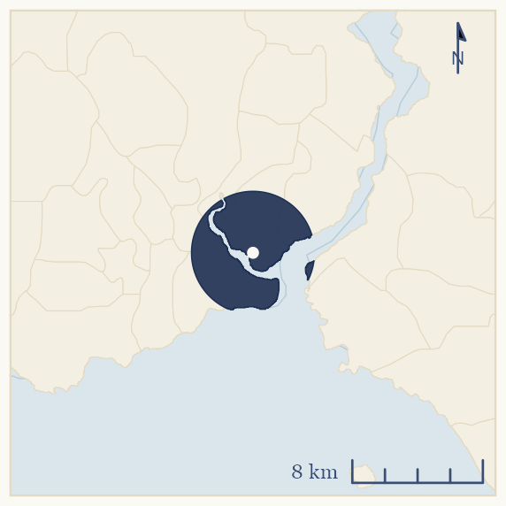</a>(1)Lightict</th>
<th colspan="2"><a href="javascript:void(0);" onclick="erdoganZoomOpen('lb-sn1'); return false;">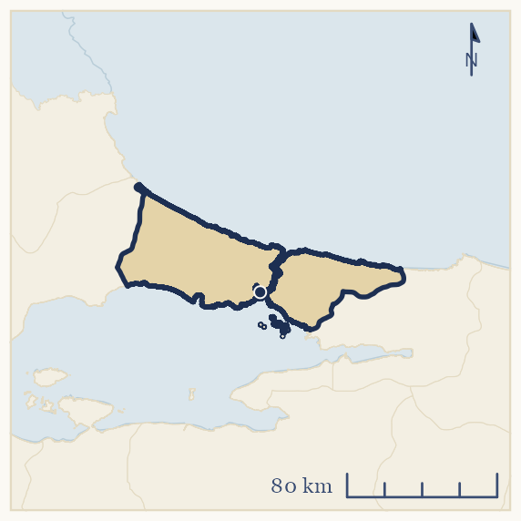</a>(2)Lightict</th>
<th colspan="2"><a href="javascript:void(0);" onclick="erdoganZoomOpen('lb-holepunch'); return false;">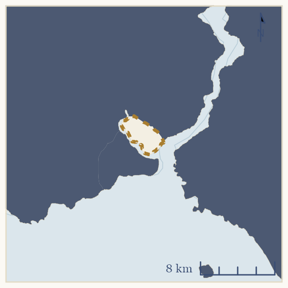</a>(3)Lightict</th>
<th colspan="2"><a href="javascript:void(0);" onclick="erdoganZoomOpen('lb-grid50'); return false;">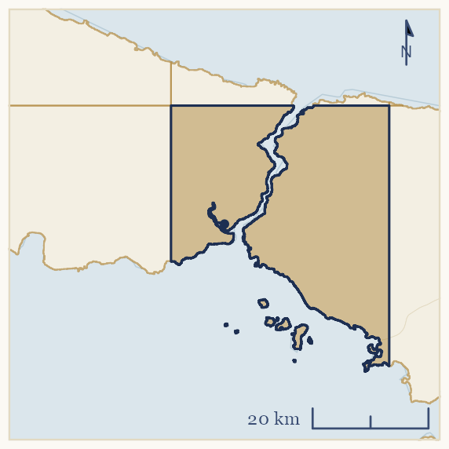</a>(4)Lightict</th>
<th colspan="2"><a href="javascript:void(0);" onclick="erdoganZoomOpen('lb-grid100'); return false;">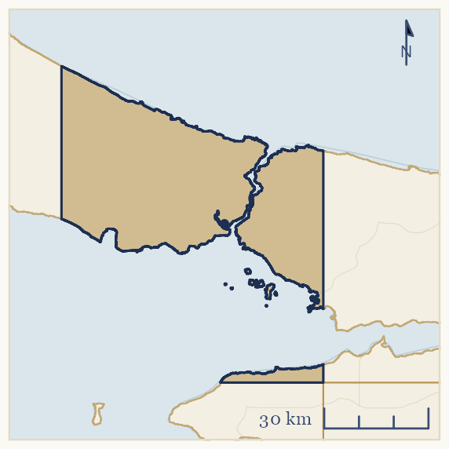</a>(5)Lightict</th>
<th colspan="2"><a href="javascript:void(0);" onclick="erdoganZoomOpen('lb-grid200'); return false;">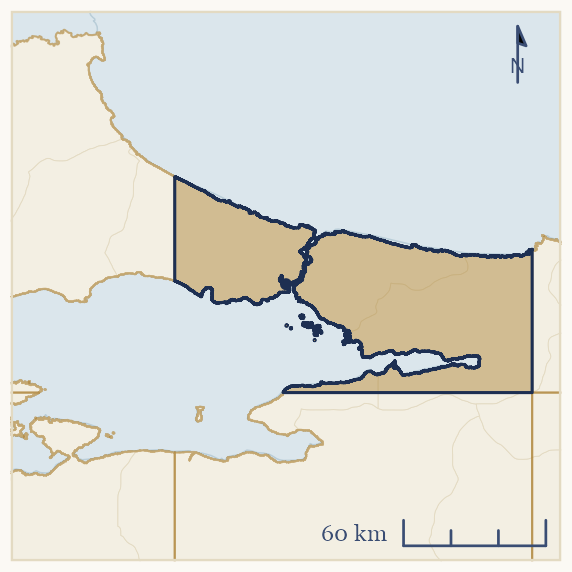</a>(6)Lightict</th>
<th colspan="2"><a href="javascript:void(0);" onclick="erdoganZoomOpen('lb-grid400'); return false;">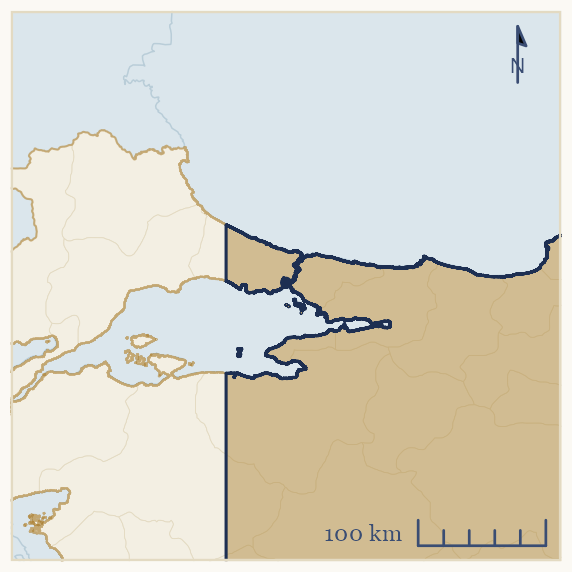</a>(7)Lightict</th>
</tr>
<tr>
<th></th>
<th>Orig.</th><th>Repl.</th><th>Orig.</th><th>Repl.</th><th>Orig.</th><th>Repl.</th><th>Orig.</th><th>Repl.</th>
<th>Orig.</th><th>Repl.</th><th>Orig.</th><th>Repl.</th><th>Orig.</th><th>Repl.</th>
</tr>
</thead>
<tbody>

<tr class="cmp-lastcoef">
<td class="cmp-var">Leaderict-1</td>
<td>0.049** (0.024)</td><td>0.025 (0.020)</td>
<td>0.026** (0.010)</td><td>0.018 (0.011)</td>
<td>0.023** (0.012)</td><td>0.010 (0.012)</td>
<td>0.043*** (0.010)</td><td>0.036** (0.013)</td>
<td>0.028** (0.011)</td><td>0.019* (0.011)</td>
<td>0.020** (0.009)</td><td>-0.001 (0.009)</td>
<td>0.005 (0.009)</td><td>-0.004 (0.008)</td>
</tr>

<tr class="cmp-subrow cmp-units">
<td class="cmp-var-sub">Units of observation</td>
<td colspan="2">5&nbsp;km circles</td>
<td colspan="2">SN1 regions</td>
<td colspan="2">SN1, excl. birth-SN2</td>
<td colspan="2">50&nbsp;km grid</td>
<td colspan="2">100&nbsp;km grid</td>
<td colspan="2">200&nbsp;km grid</td>
<td colspan="2">400&nbsp;km grid</td>
</tr>

<tr class="cmp-subrow"><td class="cmp-var-sub">Number of regions</td>
<td>520</td><td>713</td>
<td>2,242</td><td>2,408</td>
<td>2,220</td><td>2,408</td>
<td>64,204</td><td>59,212</td>
<td>17,242</td><td>16,982</td>
<td>6,101</td><td>5,312</td>
<td>2,110</td><td>1,882</td>
</tr>

<tr class="cmp-subrow"><td class="cmp-var-sub">Observations</td>
<td>9,134</td><td>11,522</td>
<td>40,157</td><td>40,936</td>
<td>39,761</td><td>40,936</td>
<td>1,048,370</td><td>988,347</td>
<td>280,210</td><td>286,650</td>
<td>101,655</td><td>91,132</td>
<td>35,889</td><td>32,547</td>
</tr>

<tr class="cmp-subrow"><td class="cmp-var-sub">Within R2</td>
<td>0.520</td><td>0.493</td>
<td>0.602</td><td>0.650</td>
<td>0.603</td><td>0.644</td>
<td>0.210</td><td>0.299</td>
<td>0.298</td><td>0.350</td>
<td>0.362</td><td>0.396</td>
<td>0.449</td><td>0.478</td>
</tr>

<tr class="cmp-subrow"><td class="cmp-var-sub">Region FE</td>
<td>Yes</td><td>Yes</td><td>Yes</td><td>Yes</td><td>Yes</td><td>Yes</td><td>Yes</td>
<td>Yes</td><td>Yes</td><td>Yes</td><td>Yes</td><td>Yes</td><td>Yes</td><td>Yes</td>
</tr>

<tr class="cmp-subrow"><td class="cmp-var-sub">Country-year FE</td>
<td>Yes</td><td>Yes</td><td>Yes</td><td>Yes</td><td>Yes</td><td>Yes</td><td>Yes</td>
<td>Yes</td><td>Yes</td><td>Yes</td><td>Yes</td><td>Yes</td><td>Yes</td><td>Yes</td>
</tr>

</tbody>
</table>

<em>Notes.</em> Fixed effect regressions using annual data for subnational regions between 1992 and 2009. The units of observation differ across columns and are indicated in their own row (see text for details). <code>Lightict</code> is the log of average nighttime light intensity plus 0.01. <code>Leaderict</code> is a dummy variable equal to 1 if region i is the birth region of the political leader in country c in year t, and 0 otherwise. Standard errors are adjusted for leader clustering. \*\*\*, \*\*, \* indicate significance at the 1%, 5%, and 10% levels, respectively.

<button type="button" class="lightbox-close" onclick="erdoganZoomClose(event, 'lb-circle'); return false;" aria-label="Close">&times;</button>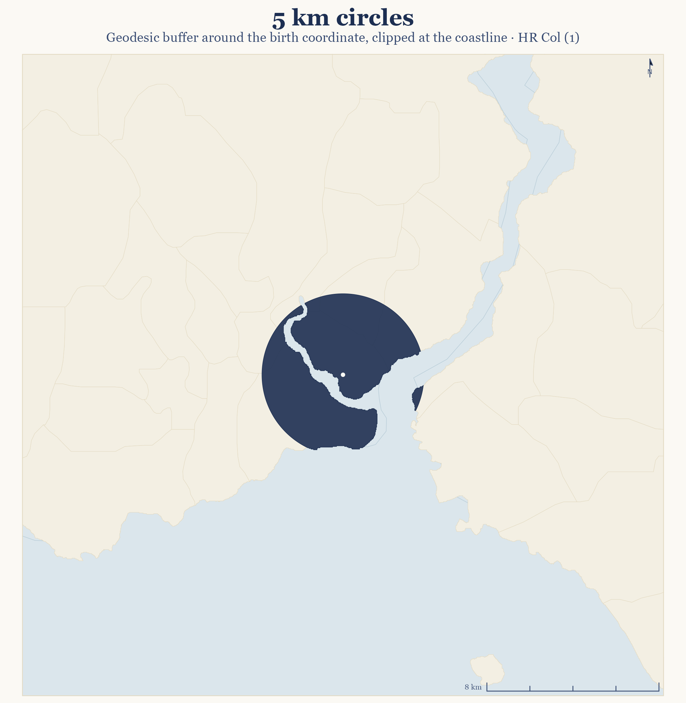

<button type="button" class="lightbox-close" onclick="erdoganZoomClose(event, 'lb-sn1'); return false;" aria-label="Close">&times;</button>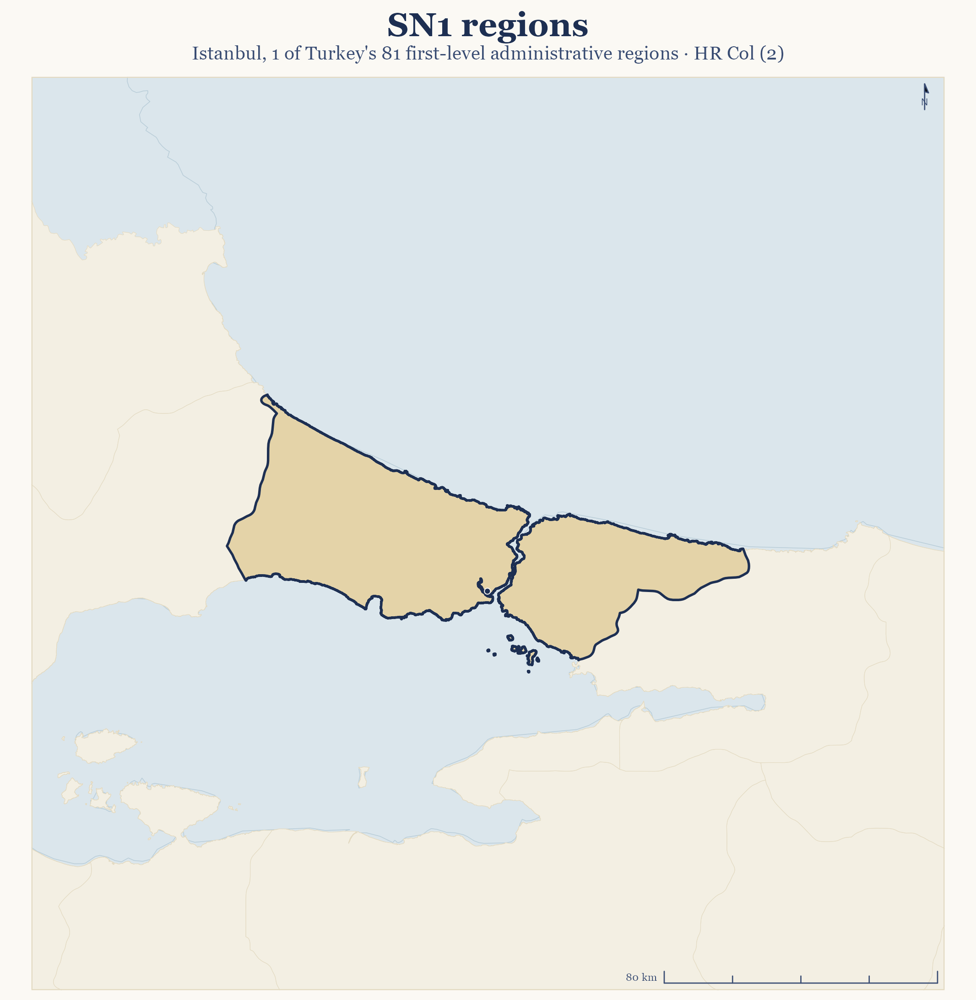

<button type="button" class="lightbox-close" onclick="erdoganZoomClose(event, 'lb-holepunch'); return false;" aria-label="Close">&times;</button>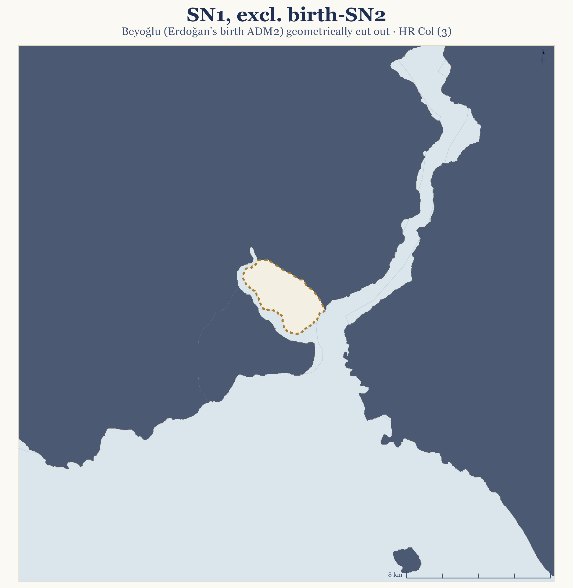

<button type="button" class="lightbox-close" onclick="erdoganZoomClose(event, 'lb-grid50'); return false;" aria-label="Close">&times;</button>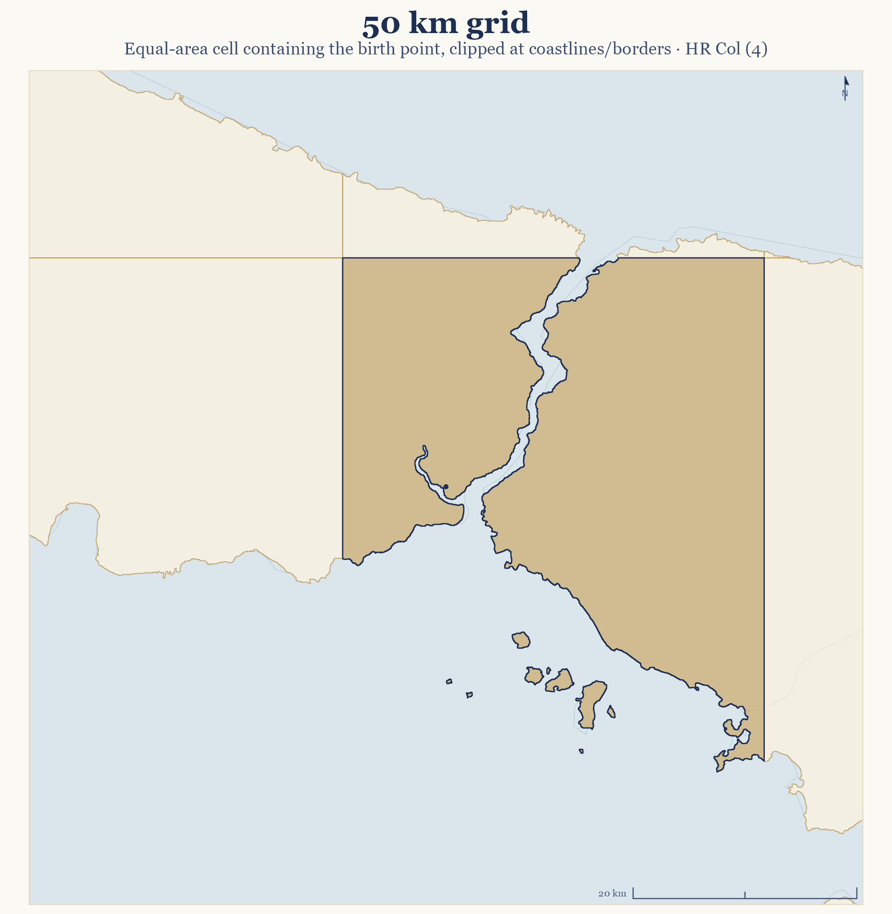

<button type="button" class="lightbox-close" onclick="erdoganZoomClose(event, 'lb-grid100'); return false;" aria-label="Close">&times;</button>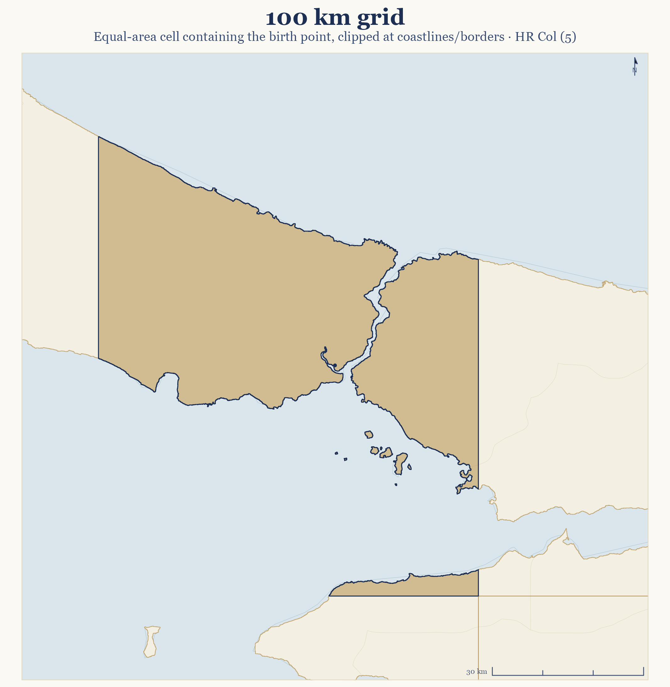

<button type="button" class="lightbox-close" onclick="erdoganZoomClose(event, 'lb-grid200'); return false;" aria-label="Close">&times;</button>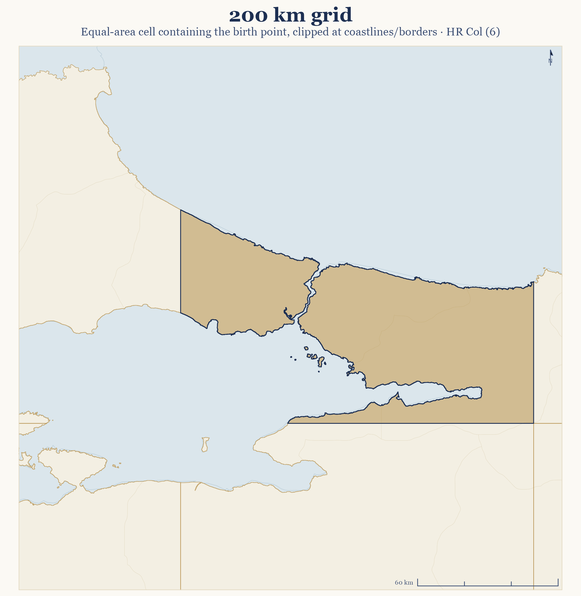

<button type="button" class="lightbox-close" onclick="erdoganZoomClose(event, 'lb-grid400'); return false;" aria-label="Close">&times;</button>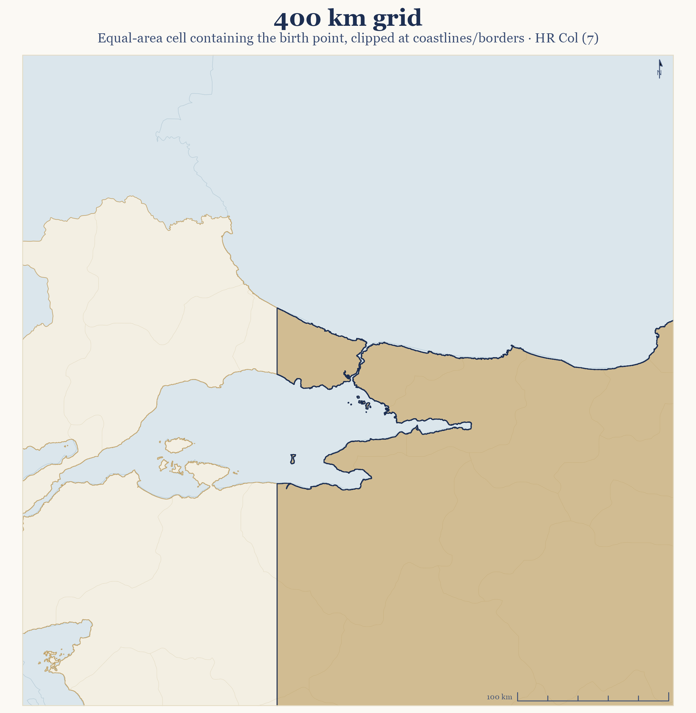

Sample restricted to HR's exact <strong>126-country, 1992-2009</strong> window. Each column changes only the <strong>size and shape of the spatial unit</strong>, not the specification: from a tight 5&nbsp;km circle around the leader's birthplace, to the full home region, to the home region with the birth district cut out, to a world grid at four coarsening resolutions. The <strong>Leader coefficient shrinks toward zero as the unit gets larger</strong> in both HR's numbers and ours, the same pattern the paper reports: favoritism shows up most clearly close to the leader's birthplace and fades out as the unit of observation grows past it.

::: {.notes}
This table changes the size of the spatial unit itself, not the
specification, so it leans on GIS work more than pure econometrics.

Column one draws a tight 5 kilometre circle around the leader's actual
birth coordinate. Our estimate comes out smaller and not significant here.

Column two is the home province as a full area average, and column three
is that same province with the leader's own birth district cut out of it,
and the coefficient drops from column two to column three the way HR
describe.

Columns four
through seven are the world grid, fifty up to four hundred kilometre
cells, and this is the cleanest replication in the table, the coefficient
shrinks steadily as the grid gets coarser and loses significance around
two hundred kilometres in both HR's numbers and ours.

So the pattern holds up independently, favoritism is strongest right at
the birthplace and fades out as the unit grows past it.
:::

# Extension {.section-slide visibility="uncounted"}

::: {.section-eyebrow}
Section 06 / 07
:::

## Extension: Beyond HR's Original Window {.content-slide}

1992&ndash;2023Time Period

Harmonized <strong>DMSP</strong>1<strong>/VIIRS</strong>2 panel, Li et al. [@li2020]: 30&nbsp;arc-sec (&sim;1&nbsp;km) WGS84 GeoTIFF, 0-63 DN scale, nearly double HR's own 1992-2009 window. VIIRS (2012 onward) is the higher-resolution successor sensor to DMSP, natively 15&nbsp;arc-sec (&sim;500&nbsp;m), with no saturation over bright urban cores.

1&nbsp;EOG DMSP [@noaa-dmsp] &middot; 2&nbsp;EOG VIIRS [@eog-viirs]

GHS-POPPopulation &middot; 1990&ndash;2020

Own pipeline [@schiavina2023]: 3&nbsp;arc-sec (&sim;100&nbsp;m) WGS84 GeoTIFF rasters, zonal-summed to ADM2, linearly interpolated to annual values.

PLAD + WikidataLeader Data

Same source as the main replication [@plad2024; @wikidata-supplement], extended to the full window.

::: {.notes}
kendin sun 
:::

## Extension: Results Over the Full 1992-2023 Window {.content-slide .cmp-slide}

<table class="cmp-table cmp-table7">
<thead>
<tr>
<th></th>
<th>(1)Lightict</th>
<th>(2)Lightict</th>
<th>(3)Lightict</th>
<th>(4)Lightict</th>
<th>(5)Lightict</th>
<th>(6)Light0ict</th>
<th>(7)Lightpcict</th>
</tr>
</thead>
<tbody>

<tr>
<td class="cmp-var">Leaderict-1</td>
<td>0.048** (0.017)</td><td></td><td></td><td>0.025* (0.010)</td><td>0.074*** (0.016)</td><td>0.035* (0.016)</td><td>0.0009 (0.0008)</td>
</tr>

<tr>
<td class="cmp-var">Leaderict</td>
<td></td><td>0.043* (0.017)</td><td></td><td></td><td></td><td></td><td></td>
</tr>

<tr>
<td class="cmp-var">Leaderict-2</td>
<td></td><td></td><td>0.046* (0.018)</td><td></td><td></td><td></td><td></td>
</tr>

<tr>
<td class="cmp-var">Lightict-1</td>
<td></td><td></td><td></td><td>0.556*** (0.026)</td><td>0.943*** (0.009)</td><td></td><td></td>
</tr>

<tr class="cmp-lastcoef">
<td class="cmp-var">Popict</td>
<td></td><td></td><td></td><td></td><td></td><td></td><td>-0.066* (0.027)</td>
</tr>

<tr class="cmp-subrow"><td class="cmp-var-sub">Number of regions</td><td>45,463</td><td>45,463</td><td>45,443</td><td>45,443</td><td>45,463</td><td>44,576</td><td>45,385</td></tr>
<tr class="cmp-subrow"><td class="cmp-var-sub">Observations</td><td>1,301,050</td><td>1,360,509</td><td>1,274,892</td><td>1,260,294</td><td>1,260,314</td><td>1,186,109</td><td>1,298,598</td></tr>
<tr class="cmp-subrow"><td class="cmp-var-sub">Within R2</td><td>0.516</td><td>0.461</td><td>0.435</td><td>0.634</td><td>0.945</td><td>0.604</td><td>0.205</td></tr>
<tr class="cmp-subrow"><td class="cmp-var-sub">Region FE</td><td>Yes</td><td>Yes</td><td>Yes</td><td>Yes</td><td>No</td><td>Yes</td><td>Yes</td></tr>
<tr class="cmp-subrow"><td class="cmp-var-sub">Country-year FE</td><td>Yes</td><td>Yes</td><td>Yes</td><td>Yes</td><td>Yes</td><td>Yes</td><td>Yes</td></tr>

</tbody>
</table>

<em>Notes.</em> Fixed effect regressions on the harmonized DMSP/VIIRS panel, 1992-2023 (except Column (5), which is standard OLS). Same seven specifications as the main replication's Table II, Columns (1)-(7); Column (8), which relies on G-Econ regional GDP, is not extended. Population is our own independently-built GHS-POP source. Standard errors clustered at the country level. \*\*\*, \*\*, \* indicate significance at the 1%, 5%, and 10% levels, respectively.

The core result <strong>holds up over the extended 1992-2023 window</strong>, using entirely our own extension-era data pipeline: the Leader coefficient is positive and significant across every specification, contemporaneous (Col 2), two-year lag (Col 3), the dynamic panel (Col 4), and the extensive margin (Col 6), the same pattern HR report in their own 1992-2009 window. Column (7)'s per-capita specification is the one exception, small and not significant, consistent with the same attenuation HR themselves see once population enters both sides of the ratio.

::: {.notes}
This is Table II's own seven specifications, minus Column 8, re-estimated
end to end on our extension-era pipeline: the harmonized DMSP-VIIRS panel
running to 2023, and our own independently-built GHS-POP population
source wherever population enters.

The pattern holds up well. Column one, the baseline one-year lag, comes in
at 0.048, significant at five percent, actually a touch larger than HR's
own 1992-2009 estimate. Contemporaneous and two-year-lag versions in
columns two and three are close in magnitude and still significant.
Column four, the dynamic panel with lagged light on the right-hand side,
shows the coefficient shrink once persistence is controlled for, same
direction HR report. Column six, the extensive margin, stays significant.

Column seven is the honest exception: once light is expressed per capita
and population enters as its own control, the Leader effect shrinks to
essentially zero and loses significance. That is not a bug, it is the same
attenuation pattern HR's own paper shows in this specification, so it
strengthens rather than undermines confidence in the replication.
:::

# Conclusion {.section-slide visibility="uncounted"}

::: {.section-eyebrow}
Section 07 / 07
:::

## Conclusion {.content-slide}

### The replication holds

- HR 2014's central finding, that political leaders' birth regions receive brighter nighttime lights while they are in power, **reproduces cleanly** in our own independently-assembled data: same sign, same order of magnitude, across every geometric definition of "region" we tried, from a 5&nbsp;km circle to a 400&nbsp;km grid cell
- The few places our numbers diverge from HR's own (Table II Col 6, the Pop sign flip in Cols 7-8) trace to **documented, real source-vintage differences**, not construction bugs

### The extension confirms it, not just once

- The same Leader effect **survives an independently-rebuilt population pipeline** (GHS-POP) and a **32-year window** nearly double HR's original span, with the effect if anything slightly stronger
- Both the original replication and the extension land on the **same qualitative story**: birth-region favoritism in nighttime light is real, robust to spatial-unit choice, and not an artifact of any one data vintage or time window

::: {.notes}
So, pulling the whole talk together. The replication itself holds: HR's
central result, that a leader's home region lights up while they're in
power, reproduces cleanly across every geometric definition of region we
tried, circles, hole-punched provinces, grids at four resolutions, using
data we assembled entirely independently of HR's own files. The handful
of places our numbers diverge trace to specific, documented source-vintage
differences, not bugs in how we built the pipeline.

And the extension isn't a separate story, it's the same story tested a
second way. Swapping in our own independently-built population source and
nearly doubling the time window doesn't break the result, if anything the
effect is a touch stronger over the longer span. Two independent tests,
the geometric replication and the temporal extension, land on the same
answer: this is a real, robust pattern in the data, not a fragile artifact
of one specific choice HR happened to make in 2014.
:::

# References {.content-slide .refs-slide}

::: {#refs}
:::

## Thank You {.hide-progress .skip-progress #thank-you-slide visibility="uncounted"}

Questions?

